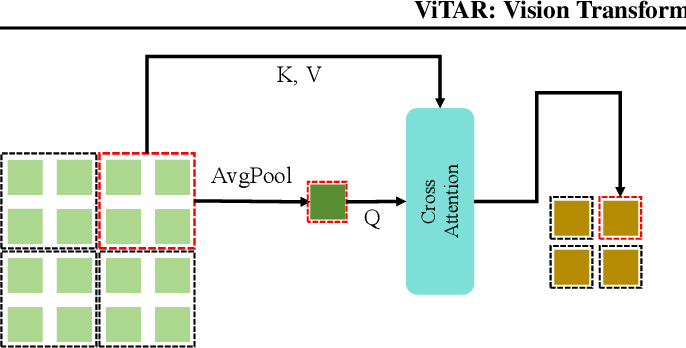

# CViT: Compression using Adaptive Token Merger



This repository implements the Adaptive Token Merger (ATM) for CViT, which tackles the challenge of resolution scalability in Vision Transformers through efficient token compression and linear attention scaling.

## Key Features

- **Dynamic Resolution Adjustment**: Utilizes a single Transformer block for efficient incremental token integration
- **Linear Attention Scaling**: ATM compresses tokens to achieve linear attention complexity
- **Resolution Scalability**: Achieves 83.3% top-1 accuracy at 1120x1120 and 80.4% at 4032x4032
- **Efficient Computation**: Reduces computational costs while maintaining high performance
- **Downstream Task Support**: Strong performance in instance and semantic segmentation
- **MAE Compatible**: Can be easily combined with Masked AutoEncoder techniques

## Installation

```bash
pip install -r requirements.txt
```

## Usage

[Usage instructions will be added]

## Model Architecture

The implementation features the Adaptive Token Merger (ATM):

- **Adaptive Token Merger (ATM)**
  - Single Transformer block design
  - Efficient token integration
  - Dynamic resolution handling
  - Seamless multi-resolution input processing
  - Token compression for linear attention scaling
  - Adaptive token reduction based on input resolution

## Citation

```bibtex
@article{fan2024vitar,
  title={ViTAR: Vision Transformer with Any Resolution},
  author={Fan, Qihang and You, Quanzeng and Han, Xiaotian and Liu, Yongfei and Tao, Yunzhe and Huang, Huaibo and He, Ran and Yang, Hongxia},
  journal={arXiv preprint arXiv:2403.18361},
  year={2024}
}
```

---

# Additional Resources

## CViT Implementation

For details about the original CViT implementation, please see [CViT_README.md](CViT_README.md). 